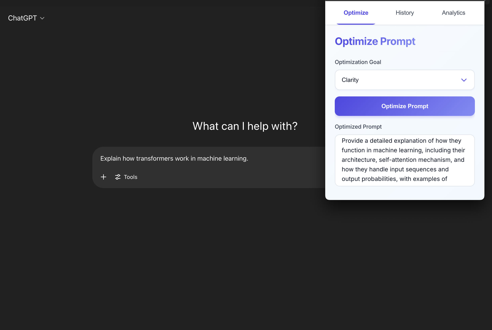
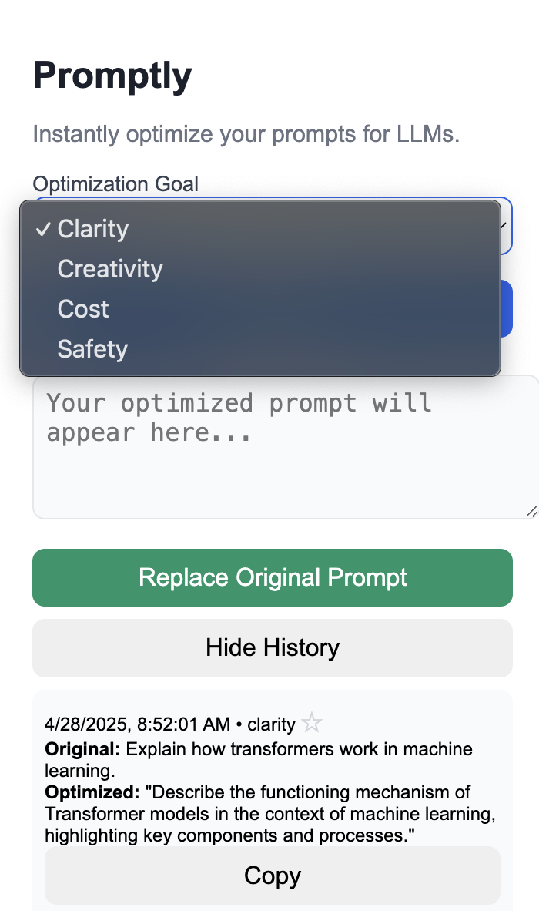

# Promptly

Promptly is a Chrome extension and backend service that helps you optimize, rewrite, and enhance your prompts for large language models (LLMs) directly in your browser. Designed for data scientists, developers, and prompt engineers, Promptly streamlines prompt engineering by providing instant, context-aware improvements—right where you work.

## Features
* **Seamless Prompt Detection:** Detects and extracts prompts from text fields on sites like ChatGPT, Notion, and Google.
* **One-Click Optimization:** Instantly rewrites prompts using state-of-the-art LLMs via OpenRouter and Groq, with multiple optimization goals:
  - **Clarity:** Improves prompts by making them more clear, specific, and unambiguous. Perfect for technical tasks and code generation.
  - **Creativity:** Rewrites prompts to encourage imaginative, open-ended, and original responses using expressive language.
  - **Cost:** Optimizes prompts for efficiency by removing redundancy while preserving core meaning, helping reduce token usage.
  - **Safety:** Rewrites prompts to reduce risks of generating unsafe, biased, or harmful content.
  - **Sora Video:** Transforms prompts into optimized Sora video generation prompts with detailed guidelines for visual storytelling.
  - **Code:** Optimizes prompts specifically for code generation, including function definitions, examples, and technical specifications.
* **Replace in Place:** Replaces your original prompt with the optimized version in the same input field—no copy-paste required.
* **Prompt History:** View and manage your previously optimized prompts with a dedicated history page, including search and star functionality.
* **Modern, Extensible Architecture:** 
  - FastAPI backend with modular design
  - Chrome extension with popup interface
  - Shared code structure for common utilities
  - Background service worker for persistent functionality
  - Dual LLM support (OpenRouter and Groq) for reliability

## Project Structure
```
promptly/
├── backend/           # FastAPI backend service
│   ├── app/          # Main application code
│   └── requirements.txt
├── extension/        # Chrome extension
│   ├── assets/       # Images and static files
│   ├── popup/        # Extension popup interface
│   ├── background.js # Service worker
│   ├── content.js    # Content script for page interaction
│   └── manifest.json # Extension configuration
├── shared/           # Shared utilities and types
└── docs/            # Documentation
```

## Demo

<p align="center">
  
</p>
<p align="center"><em>Promptly in action on ChatGPT.com</em></p>

<p align="center">
  
</p>
<p align="center"><em>Promptly's prompt history section (compact view)</em></p>

## Getting Started

### 1. Clone the Repository
```bash
git clone https://github.com/yourusername/promptly.git
cd promptly
```

### 2. Backend Setup
* Navigate to the backend directory:
```bash
cd backend
```

* Create a virtual environment and activate it:
```bash
python3 -m venv venv
source venv/bin/activate  # On Windows: .\venv\Scripts\activate
```

* Install dependencies:
```bash
pip install -r requirements.txt
```

* Set up your `.env` file with your OpenRouter API key:
```
OPENROUTER_API_KEY=your_openrouter_key_here
```

* Start the FastAPI server:
```bash
uvicorn app.main:app --reload --port 8000
```

### 3. Extension Setup
* Go to `chrome://extensions/` in your browser.
* Enable **Developer mode**.
* Click **Load unpacked** and select the `extension` folder.
* The Promptly icon should appear in your Chrome toolbar.

## Usage
1. **Navigate to a supported site** (e.g., ChatGPT).
2. **Click into a prompt field** to activate Promptly.
3. **Open the Promptly extension** from your Chrome toolbar.
4. **Select your optimization goal** and click **Optimize**.
5. **Review the optimized prompt** in the popup.
6. **Click "Replace"** to insert the improved prompt back into the original field.
7. **Access your history** by clicking the history icon in the popup.

## Technical Details
* **Backend:**
  - FastAPI for high-performance API endpoints
  - OpenRouter integration for LLM access
  - Modular prompt engineering system
  - Environment-based configuration

* **Extension:**
  - Manifest V3 compliant
  - Service worker for background tasks
  - Content script for page interaction
  - Popup interface for user interaction
  - History management system

* **Shared Code:**
  - Common types and interfaces
  - Shared utilities
  - Consistent configuration

## Roadmap
* [ ] Enhanced UI/UX with modern design system
* [ ] Advanced prompt analytics and insights
* [ ] Custom prompt templates
* [ ] Multi-model support with performance metrics
* [ ] Team collaboration features
* [ ] API rate limiting and usage tracking
* [ ] Export/import prompt history
* [ ] Keyboard shortcuts for quick actions

## Contributing

Contributions are welcome! Please open an issue or submit a pull request for bug fixes, new features, or documentation improvements.

## License

MIT License

## Acknowledgments
* [OpenRouter](https://openrouter.ai/) for LLM API access
* [Mistral AI](https://mistral.ai/) for the default model
* The open-source community for inspiration and support
